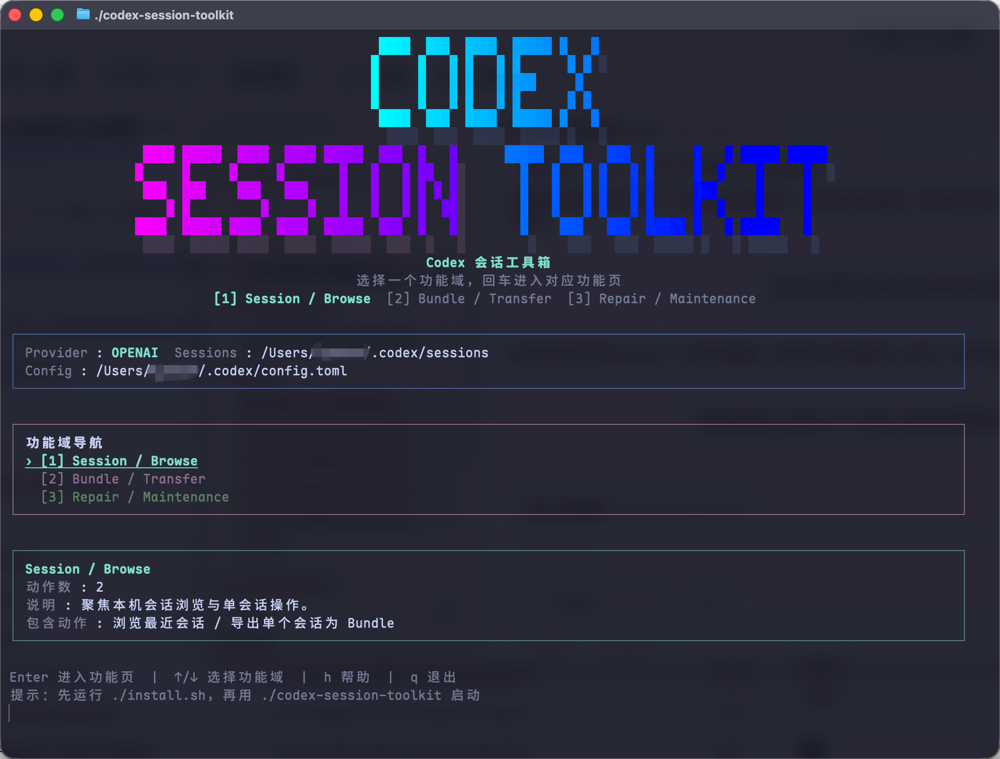

# Codex Session Toolkit

上游仓库：[goodnightzsj/codex-session-cloner](https://github.com/goodnightzsj/codex-session-cloner.git)

`Codex Session Toolkit` 是一个面向 Codex 会话的浏览、迁移、导入导出和修复工具箱。
它不是单一的 clone 脚本，而是一套统一的 TUI + CLI，用来处理会话管理里最常见的几类问题。



## 适用场景

如果你经常在 Codex Desktop 和 CLI 之间切换，或者有多台机器需要同步会话，这个项目主要帮你解决这些事：

- 快速浏览本机最近会话，确认 session 类型、provider、cwd、rollout 路径
- 把单个会话或整批 Desktop / CLI 会话导出成 Bundle，迁移到另一台电脑
- 从别的设备导入 Bundle，并按设备文件夹、分类文件夹管理导出记录
- 在切换 provider 后继续复用旧会话，又不覆盖原始 rollout
- 修复 Codex Desktop 左侧线程不可见、`session_index.jsonl` 缺失、`threads` 表不同步等问题

## 功能概览

### Session / Browse

- 浏览最近会话
- 过滤并查看会话详情
- 导出单个会话为 Bundle

### Bundle / Transfer

- 浏览 Bundle 仓库
- 校验 Bundle 健康度
- 批量导出全部 Desktop 会话为 Bundle
- 批量导出全部 Active Desktop 会话为 Bundle
- 批量导出全部 CLI 会话为 Bundle
- 导入单个 Bundle 为会话
- 先选设备文件夹、再选分类文件夹，批量导入整类 Bundle
- 导入时保留本地更新更晚的 rollout，只补齐缺失 history，避免覆盖更新过的会话

### Repair / Maintenance

- 克隆到当前 provider
- Dry-run 预演 clone / clean / repair
- 清理旧版无标记 clone
- 修复 Desktop 可见性
- 修复并纳入 CLI 线程
- 自动修复 / 重建 `session_index.jsonl`
- 自动 upsert `state_*.sqlite` 的 `threads` 表
- 自动补充 Desktop workspace roots

## 安装与启动

### 最推荐：直接执行安装脚本

仓库已经自带安装脚本。大多数情况下，不需要自己手敲 `pip install`，直接执行安装脚本即可。

安装脚本会自动完成这些事：

- 在项目根目录创建本地 `.venv/`
- 把当前项目安装到这个本地环境里
- 保留仓库 launcher，安装完成后可以直接启动工具

macOS / Linux:

```bash
chmod +x ./install.sh ./install.command ./codex-session-toolkit ./codex-session-toolkit.command
./install.sh
./codex-session-toolkit
```

macOS 也可以直接双击：

- `install.command`
- `codex-session-toolkit.command`

Windows：

- 双击 `install.bat`
- 或运行：

```powershell
.\install.ps1
.\codex-session-toolkit.cmd
```

安装完成后常用入口：

- macOS / Linux：

```bash
./codex-session-toolkit
./codex-session-toolkit.command
./.venv/bin/codex-session-toolkit
```

- Windows：

```powershell
.\codex-session-toolkit.cmd
.\.venv\Scripts\codex-session-toolkit.exe
```

查看当前版本：

```bash
./codex-session-toolkit --version
```

### 开发模式：不安装也可直接运行

如果你是在仓库里继续改代码，也可以不先安装，直接通过仓库 launcher 启动。

macOS / Linux:

```bash
./codex-session-toolkit
./codex-session-toolkit.command
```

Windows:

```powershell
.\codex-session-toolkit.ps1
```

如果当前目录是 git 工作树，并且 `src/codex_session_toolkit/` 存在，仓库 launcher 会优先进入源码模式，这样改完代码后重新启动就能立刻生效。

如果当前目录不是 git 工作树，例如 release 解压目录，launcher 会优先使用本地 `.venv` 里的已安装版本。

如果你想手动覆盖这个选择逻辑，可以设置：

- `CST_LAUNCH_MODE=source`
- `CST_LAUNCH_MODE=installed`
- `CST_LAUNCH_MODE=auto`（默认）

### 生成可分发压缩包

如果你想把当前仓库直接打成一个可发给别人的安装包，可以运行：

```bash
./release.sh
```

或者：

```bash
make release
```

它会在 `./dist/releases/` 下生成：

- 一个干净的发布目录
- 一个 `.tar.gz`
- 如果系统有 `zip`，再额外生成一个 `.zip`

上传到 GitHub Release 时，直接上传这两个文件即可：

- `./dist/releases/codex-session-toolkit-<version>.tar.gz`
- `./dist/releases/codex-session-toolkit-<version>.zip`

对方解压后，直接运行：

- macOS / Linux：`./install.sh`
- Windows：`.\install.ps1` 或双击 `install.bat`

release 只会携带分发所需文件；CI、测试、兼容层、release 构建器本身和本地缓存都不会进入发布包。

### 直接安装到当前 Python 环境

如果你就是想装进自己当前的 Python 环境，也仍然支持标准安装方式：

macOS / Linux:

```bash
python3 -m pip install -e .
codex-session-toolkit
```

Windows:

```powershell
py -3 -m pip install -e .
codex-session-toolkit
```

也支持模块方式：

```bash
python3 -m codex_session_toolkit
```

### 用工程命令管理本地开发

如果你想把这个仓库当成一个长期维护的项目来用，而不是临时脚本，可以直接用顶层 [Makefile](./Makefile)：

```bash
make help
make bootstrap
make bootstrap-editable
make release
make run
make install
make test
make smoke
make check
```

## TUI 使用方式

在交互终端里无参数启动，会进入统一 TUI。

主菜单分为 3 个功能域：

1. `Session / Browse`
2. `Bundle / Transfer`
3. `Repair / Maintenance`

当前交互方式是两级结构：

- 首页先选择功能域
- 回车进入该功能页
- 在功能页中选择具体动作再执行

常用按键：

- `↑/↓` 或 `j/k`：移动
- `Enter`：进入功能页或执行动作
- `←/→`：切换上一页 / 下一页功能页
- `PgUp/PgDn`：功能页切换
- `h`：帮助
- `q`：返回或退出
- `0`：直接退出

浏览器相关按键：

- `/`：过滤会话 / Bundle
- `Enter`：在浏览模式下进入当前条目的操作面板，在选择模式下直接确认
- `d`：只查看详情，不直接执行导入 / 导出
- `e`：在会话列表中直接导出为 Bundle
- `s`：切换 Bundle 导出方式
- `m`：按导出机器切换 Bundle 过滤
- `l`：切换“显示全部历史 Bundle / 仅显示最新 Bundle”
- `i / v`：导入当前 Bundle 为会话 / 导入并自动创建缺失目录

## CLI 用法

### 兼容入口参数

直接 clone：

```bash
codex-session-toolkit
```

Dry-run：

```bash
codex-session-toolkit --dry-run
```

清理旧版无标记 clone：

```bash
codex-session-toolkit --clean
```

跳过 TUI，直接执行 clone：

```bash
codex-session-toolkit --no-tui
```

查看版本：

```bash
codex-session-toolkit --version
```

### Canonical 子命令

Repair / Maintenance:

```bash
codex-session-toolkit clone-provider
codex-session-toolkit clone-provider --dry-run
codex-session-toolkit clean-clones
codex-session-toolkit clean-clones --dry-run
```

浏览本机会话：

```bash
codex-session-toolkit list
codex-session-toolkit list desktop
codex-session-toolkit list 019d58
```

浏览 Bundle 导出记录：

```bash
codex-session-toolkit list-bundles
codex-session-toolkit list-bundles --source desktop
codex-session-toolkit list-bundles 019d58
```

校验 Bundle 导出目录：

```bash
codex-session-toolkit validate-bundles
codex-session-toolkit validate-bundles --source desktop
codex-session-toolkit validate-bundles --source desktop --verbose
```

导出单个会话为 Bundle：

```bash
codex-session-toolkit export <session_id>
```

批量导出 Desktop 会话为 Bundle：

```bash
codex-session-toolkit export-desktop-all
codex-session-toolkit export-desktop-all --dry-run
codex-session-toolkit export-active-desktop-all
codex-session-toolkit export-active-desktop-all --dry-run
```

兼容旧写法：

```bash
codex-session-toolkit export-desktop-all --active-only
```

批量导出 CLI 会话为 Bundle：

```bash
codex-session-toolkit export-cli-all
codex-session-toolkit export-cli-all --dry-run
```

导入单个 Bundle 为会话：

```bash
codex-session-toolkit import <session_id>
codex-session-toolkit import <session_id> --source desktop --machine Work-Laptop
codex-session-toolkit import <session_id> --source desktop --export-group active
codex-session-toolkit import ./codex_sessions/<machine>/single/<timestamp>/<session_id>
codex-session-toolkit import --desktop-visible <session_id>
```

批量导入 Bundle 为会话：

```bash
codex-session-toolkit import-desktop-all
codex-session-toolkit import-desktop-all --desktop-visible
codex-session-toolkit import-desktop-all --machine Work-Laptop
codex-session-toolkit import-desktop-all --machine Work-Laptop --latest-only
codex-session-toolkit import-desktop-all --export-group active
```

修复 Desktop 可见性：

```bash
codex-session-toolkit repair-desktop
codex-session-toolkit repair-desktop --dry-run
codex-session-toolkit repair-desktop --include-cli
codex-session-toolkit repair-desktop --include-cli --dry-run
```

## Bundle 目录策略

所有 Bundle 相关动作都只允许在当前目录下的 `./codex_sessions/` 中进行。

这包括：

- 导出
- 浏览
- 校验
- 导入

不再提供用户可自定义的 `--bundle-root`。

如果你手动传入一个 Bundle 目录，这个目录也必须位于 `./codex_sessions/` 下面，否则工具会拒绝执行。

默认目录：

- Codex 数据目录：`~/.codex/`
- Bundle 根目录：`./codex_sessions/`

默认归档结构：

- `./codex_sessions/<machine>/single/<timestamp>/<session_id>/`
- `./codex_sessions/<machine>/desktop/<timestamp>/<session_id>/`
- `./codex_sessions/<machine>/active/<timestamp>/<session_id>/`
- `./codex_sessions/<machine>/cli/<timestamp>/<session_id>/`

其中 `<machine>` 默认来自当前电脑主机名；如需手动指定，可以在导出前设置环境变量 `CST_MACHINE_LABEL`。

兼容旧布局：

- 工具仍会继续识别 `./codex_sessions/bundles/` 与 `./codex_sessions/desktop_bundles/` 下的旧导出
- 但新的导出默认都会写入统一的 `./codex_sessions/<machine>/<category>/...` 结构

Bundle 内默认包含：

- `codex/<relative rollout path>.jsonl`
- `history.jsonl`
- `manifest.env`

## 安全性说明

- 不修改对话正文内容
- 不会悄悄覆盖原始 session
- 清理操作只针对旧版无标记 clone
- 导入前会校验 manifest、路径和 JSONL
- 建议所有写入型动作第一次都先用 dry-run

## 运行环境

- Python >= 3.8
- 无第三方运行时依赖
- 支持 Windows / macOS / Linux

## 终端环境变量

- `NO_COLOR=1`
- `CST_ASCII_UI=1`
- `CST_TUI_MAX_WIDTH=120`
- `CST_MACHINE_LABEL=My-MacBook`
- `CST_LAUNCH_MODE=auto|source|installed`


## 致谢

本项目基于 [yezannnnn/agentGroup](https://github.com/yezannnnn/agentGroup) 进行开发和扩展。感谢原作者 [@yezannnnn](https://github.com/yezannnnn) 提出的四 AI 专业分工协作框架理念，为本项目奠定了坚实的基础。

## 社区支持

<div align="center">

**学 AI，上 L 站**

[](https://linux.do/) [](https://linux.do/)

本项目在 [LINUX DO](https://linux.do/) 社区发布与交流，感谢佬友们的支持与反馈。

</div>

## 许可证

MIT License

本项目在 LINUX DO 社区发布与交流，感谢佬友们的支持与反馈。

许可证
MIT License
